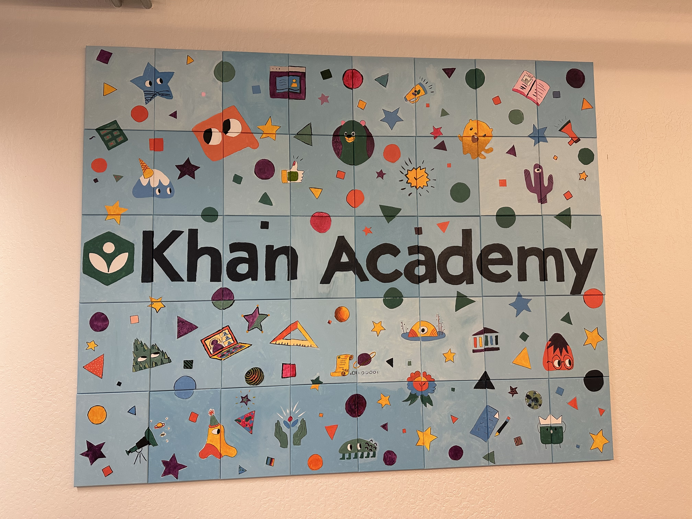
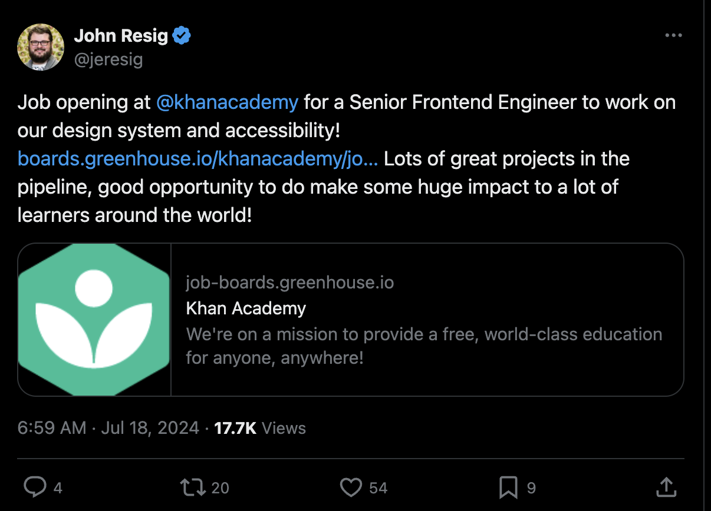

In October 2025, I started a new role as a Senior Engineer II at Khan Academy, a nonprofit education technology company based in Mountain View, California. I work remotely on our Wonder Blocks design system, accessibility, and tooling across the company and I love it!

I describe Khan Academy as an education platform to help your kid learn math, literacy, and other subjects. We're working hard right now to help students and teachers primarily in school districts, but historically Khan Academy has reached millions of grassroots learners (and we still do).

Because I've been so heads-down with work and my family, it has taken me forever to get this blog post written. Still, it's swirled around in my head ever since I joined. In this post, I'll talk about my new role and the search required in a fast-changing industry. It wasn't easy. Luckily, the right door opened at the right time.

## Back-to-back job searches

After returning from maternity leave and independent work as an accessibility engineering consultant in early 2023, the industry had clearly changed. Three major factors contributed to me taking on a full-time role again: 

1) I missed working with teams in-house. I got to do some great consulting work, but I didn't feel close enough to have a lasting impact in codebases. I wanted to build User Interfaces (UIs), write automated tests, watch them fail, fix them, and see things through. Accessibility consultants in particular don't get that close and remediation feels like clean-up work. I wanted to dig in and become a better software engineer.
2) The easy-to-find freelance work I had pre-2022 mostly dried up and I didn't want to hustle. Layoffs started happening and budgets were cut. The winds had shifted.
3) Our accountant also said we would be better off as a family with a W2 for our finances, especially for our healthcare. This ended up being pretty important.

My first job search was pretty tough as a new mom, trying to get my engineering career back on the rails from consulting and developer relations work. I got some big-deal interviews and struggled with coding anxiety. I studied and got better at async control flow. I interviewed a lot and failed a lot.

I ended up getting hired at a small digital agency called Principle Studios as a React engineer. My job was to migrate a home warranty web application from Angular to React. I worked with some really smart people, got to use newer web tooling and really sharpened my skills with TypeScript, React Query, Storybook, and more. Unfortunately, Principle was acquired by a marketing tech firm and practically changed overnight. I went from being a React engineer to an Adobe Experience Manager developer and all of a sudden my career was off track again.

So I started interviewing once more, less than a year later. I got more big-deal interviews and saw behind the curtain at some really impressive companies including Figma, Stripe, and Cisco Meraki. The coding interviews gave me insight into interesting problems these companies were solving. I was still rejected a lot but the practice made me a better engineer.

## Enter Khan Academy

Eventually, I saw a job posting from John Resig at Khan Academy on Twitter (where I no longer hang out, so it was a blip in time). It was _my job_: they were hiring for a Senior Frontend Engineer to work on their design system and accessibility! I applied immediately and interviewed. I passed the algorithms interview (and others) without anxiety and it just felt right.

It still gives me butterflies that it worked out so well as I'm now doing the exact work I yearned to do for years: UI engineering, accessibility, and automated tooling. I enjoy working with really smart, caring people.

## Likes and growth edges

There's a lot to like at Khan Academy: remote work, the pay is good for a nonprofit, and the benefits are thoughtfully organized. My manager is very supportive and kind. We have focus Wednesdays with fewer meetings, occasional focus weeks, and periodic Wellness Days off throughout the year. There is a flexible, open PTO policy. Every 5 years, employees are encouraged to take a sabbatical (5 weeks for 5 years, 10 weeks for 10 years, etc.)

The dedication to pedagogy (the method and practice of teaching) is evident in our product development priorities, which I really appreciate. There is a lot of care to ensure the things we create have positive effects for learners across the world.

There are also some challenging parts. Being a nonprofit, we are often required to do more with less. There is always more work than we have time for. Our codebase is also quite large and complicated in places due to its age, so it can be difficult sometimes to make moves as a frontend infrastructure engineer. There have been some solid codebase overhaul efforts recently that I am fortunate to enjoy, because they weren't always there.

Lately, there has been a big push to adopt Artificial Intelligence (AI) in nearly everything we do. I have definitely benefitted from the productivity boost in areas that I didn't feel as strong (and I like Cursor), but there's a tension. I don't think I would be as effective if I hadn't spent all that time hammering on code patterns and engineering without it -- I'm pretty sure I'd be lost. I want want to keep my mind sharp and not offload too much cogition.

I also see potential for a widening gulf, at least in my own ability to keep up with the industry, if I weren't in this seat building with AI every day. It would be hard to imagine what frontend engineering teams are currently doing if I wasn't also using these tools with real-world constraints. For example, we are thinking about best how to support people _and_ computers as consumers of our design system. Every few weeks feels like new territory. It's hard at times but I'm glad to be here.

## What's next

I'll keep on building, testing, juggling priorities, and connecting with my colleagues. I really cherish this opportunity to work at Khan Academy and have an impact for learners worldwide. I hope to be here for a long time. When I was looking for this job, one of my main goals was to land somewhere for the long haul. So it's encouraging to see folks on my team celebrating 5, 10, and 15 year anniversaries. I hope to make them proud.
